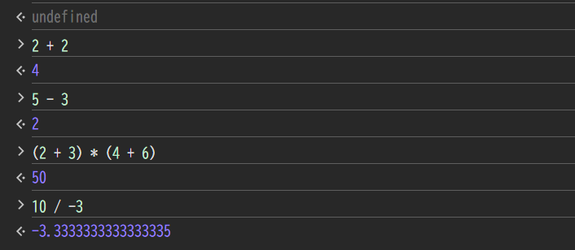
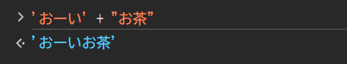
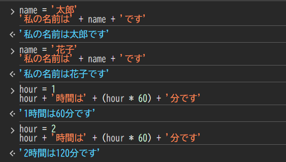

# 形式張らないJavaScriptの紹介

この章ではJavaScriptコンソールを利用します。
JavaScriptコンソールでは1行ずつ入力したコードを、1行ずつ実行できます。
プログラミング経験のない方であっても簡単にJavaScriptを試してみることができます。

## JavaScriptを電卓として使う

それでは、簡単なJavaScriptの例をいくつか試しましょう。
プロンプト(`>`のマーク)の後に続けてJavaScriptの入力を行うことが出来ます。

### 数値

数値のみを扱う場合において、JavaScriptコンソールは単純な電卓のように動作します。
式を入力すると、その結果が表示されます。式の文法は難しくありません。
演算子`+`, `-`, `*`, `/` は他のほとんどの言語と同じように動作します。
丸括弧をグループ化に使うこともできます。いくつか試してみましょう。

たとえば足し算
```js
2 + 2
```

引き算
```js
5 - 3
```

掛け算
```js
(2 + 3) * (4 + 6)
```

割り算
```js
10 / -3
```

実行例



### 文字列

数値の他に、JavaScriptでは文字列も操作できます。
シングルクォート（`'あいうえお'`）またはダブルクォート(`"かきくけこ"`)で括った範囲が文字列となります。

`+`記号は数値の足し算にも使用しましたが、文字列に対して使用すると文字列を連結することができます。

```js
'おーい' + "お茶"
```


### 数値と文字列を区別する

プログラムの世界で数値と文字列は明確に区別されます。
例えば
```js
10
```
と
```js
'10'
```
の見た目はよく似ていますが、`10`は数値で`'10'`は文字列です。
```js
10 + 10
```
と
```js
'10' + '10'
```
の結果を予想してから実行してみましょう。


### 変数

変数を使うとデータに名前をつけることができます。
`=`記号は変数に値を代入するときに使います。

数値に使うこともできるし
```js
width = 30
height = 5 * 10
width * height
```

文字列に使うことも、
```js
name = '太郎'
'私の名前は' + name + 'です'
```

組み合わせて使うこともできます。
```js
hour = 1
hour + '時間は' + (hour * 60) + '分です'
```

実行例


