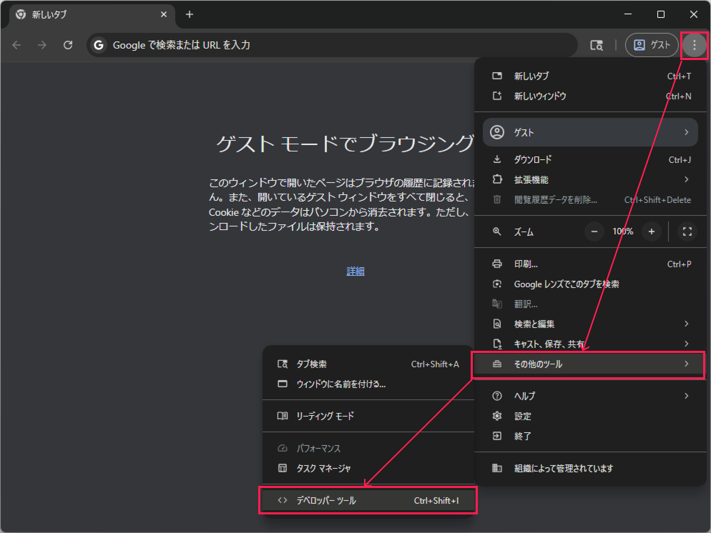
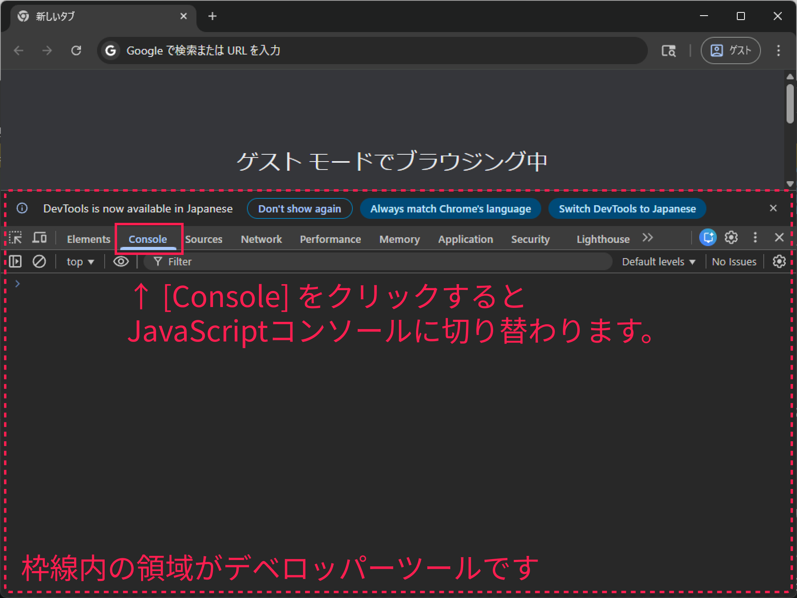

# JavaScriptコンソールを使ってみる

本格的なプログラミングを開始するには幾つかの準備と知識が必要です。
本来はそれらをひとつひとつ体験してを覚えていくものですが
幸いなことに、JavaScriptには「JavaScriptコンソール」があります。
まずはそれを起動しましてみましょう。

## JavaScriptコンコールを起動する

JavaScriptコンソールはChromeからすぐに起動することがでします。
Chromeのウィンドウ右上部のメニューボタン（`︙`）をクリックし、
`[その他のツール]->[デベロッパーツール]`と辿って下さい。
(`F12`キーを押すことでもデベロッパーツールを起動できます)

起動したデベロッパーツールの画面から`[Console]`をクリックし、
画面をJavaScriptコンソールに切り替えましょう。

