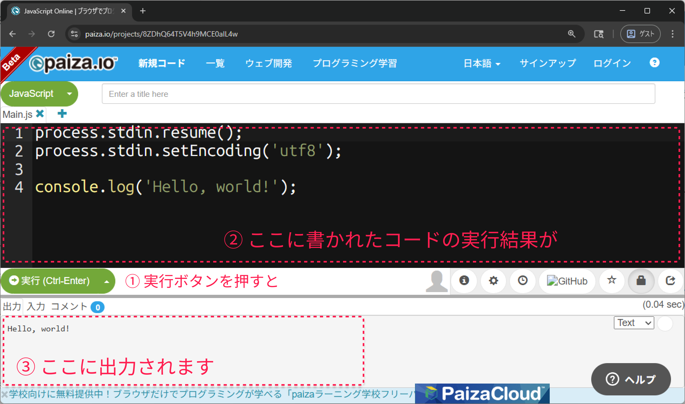

# paiza.ioの使い方

もちろん、JavaScriptは`2 + 2`よりももっと複雑なことに使うことができます。
ここからはpaiza.ioを使って、基本的なJavaScriptの構文や、それらを組み合わせた数行のプログラムに慣れて行きましょう。

```js
console.log('Hello, world!');
```

プログラミングの経験がない方も、このプログラムが何を実行するためのものか推測してみてください。
次のセクションで、その推測が正しいか確認しましょう。

↓

↓

↓

↓

↓

↓

↓

↓

↓

## paiza.ioを開く

Chromeで[paiza.io](https://paiza.io/projects/8ZDhQ64T5V4h9MCE0alL4w)を開きます。
画面の下部には実行結果が表示されています。推測した結果は当たっていましたか？


## 説明

- `console.log(...)`は数値や文字列などのデータをコンソールに出力する為の機能です。
- 丸括弧`(` と `)`で括られたデータを出力することが出来ます。
- ChromeのJavaScriptコンソールでは計算(`2 + 2`など)の結果(`4`)が自動的に出力されましたが、ここからは`console.log(...)`を使って出力します。
- 句点(`。`)が日本語の文末であるように、行末にあるセミコロン(`;`)がJavaScriptの文末です。


## コードを書き換えてみる

ソースコードの先頭２行は"おまじない"なので、
意味が分からなくても問題ありません。

```js
process.stdin.resume();
process.stdin.setEncoding('utf8');
```

プログラムの本体はこの1行です。
```js
console.log('Hello, world!');
```

例えばこれを
```js
console.log('Hello, JavaScript!');
```

のように変更して「実行」してみましょう。
実行結果は想定通りになりましたか？

## Tips

プログラムを習得する近道はトライ＆エラーです。

- プログラムがどの様に動作するのか予想し、実際に実行して結果を確かめる。
- エラーの原因について仮説を立て、その仮説を検証する。

その繰り返しによって理解が深まります。
ここから先も幾つかのサンプルコードが登場しますが、
それらを読むだけではなく、何度も書き換えながら実際に実行して動作を確認しましょう。

もしも何かを間違えてエラーが発生したり、想定通りに動作しなくなっても大丈夫です。
これは練習なので、何度でもやり直すことができます。
