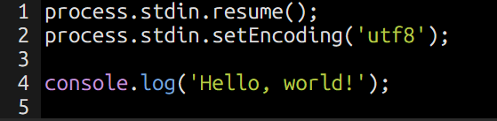

# paiza.ioを開く

パソコンのウェブブラウザで[paiza.io](https://paiza.io/projects/8ZDhQ64T5V4h9MCE0alL4w)プレイグラウンドを開きます。



コードエディタにはすでにコードがいくつか入力されています。


```js
console.log('Hello, world!');
```
プログラミングの経験がない方も、このプログラムが何を実行するためのものか推測してみてください。
次のセクションで、その推測が正しいか確認しましょう。
